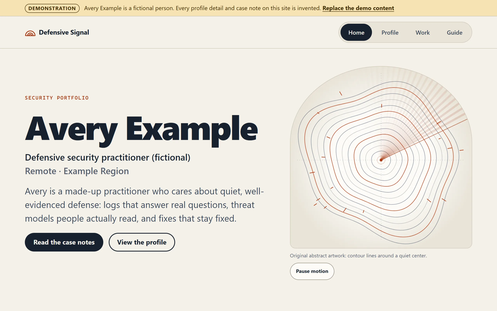
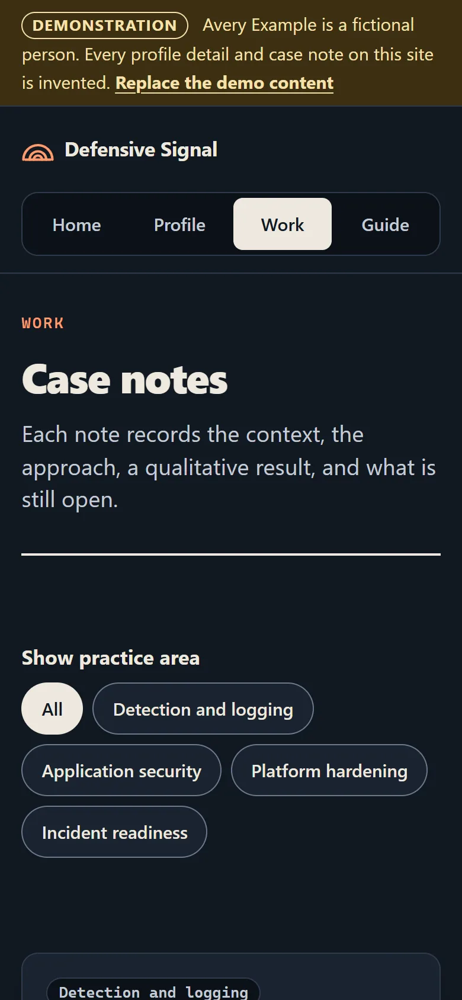

# Defensive Signal — Accessible Cybersecurity Portfolio Starter

[](https://github.com/Nitheesh2325/defensive-signal-portfolio/actions/workflows/ci.yml?query=branch%3Amain)
· [MIT License](LICENSE) · Version [0.1.1](CHANGELOG.md)

Created and maintained by [Nitheesh Chanambatla](https://github.com/Nitheesh2325).

Defensive Signal is a small, responsive, multi-route starter for building an
honest, accessible cybersecurity portfolio. It is built with TypeScript and
Vite, has no runtime dependencies, and ships with a clearly labeled fictional
practitioner, **Avery Example**, so you can see the shape of a finished site
before replacing the content with your own.

Built with TypeScript · HTML · CSS · Vite · Canvas 2D · SVG · GitHub Actions.
The `.mjs` files under `scripts/` are Node-based audit and build tooling; they
are not delivered to the browser as part of the site.

> **Demonstration content.** Avery Example is not a real person. Every case
> note is invented. Contact details use the reserved `example.invalid` domain.

## Demo

No hosted demo is currently provided. The fictional demonstration runs
locally. With Node.js 20.19+ or 22.12+ installed:

```sh
npm ci
npm run dev
```

Then open <http://127.0.0.1:5173> in your browser.

### Screenshots

These show the fictional demonstration content.





## Features

- **Responsive multi-route site.** Home, Profile, Work, and Guide pages, plus a
  404 page, built with TypeScript and Vite. Layouts reflow from wide desktop
  screens down to 320 CSS pixels.
- **Progressive enhancement.** Every page is complete HTML generated at build
  time and stays readable with JavaScript turned off. Scripts only add
  optional behavior.
- **One typed content module.** All profile and case-note content on Home,
  Profile, and Work comes from `src/content/profile.ts`, checked against
  `src/content/schema.ts`. Interface labels such as headings and buttons live
  in `src/render/pages.ts`. The schema has no fields for skill percentages or
  invented metrics.
- **Case notes with shareable filtering.** Each note records the context,
  approach, result, and what is still open. The Work filter stores the
  selected practice area in the URL, so filtered views can be shared and
  browser Back and Forward work as expected.
- **Optional, bounded motion.** Original abstract artwork with an optional
  Canvas sweep that has a visible pause control, pauses when offscreen or
  hidden, and never starts when reduced motion is requested.
- **Accessibility foundations.** Keyboard navigation with a visible focus
  indicator, a skip link, forced-colors support, and light and dark themes
  that follow the visitor's system setting. See
  [`docs/accessibility.md`](docs/accessibility.md) for the design goals and
  what still needs manual testing.
- **Strict Content Security Policy** on every built page.
- **No runtime dependencies, analytics, trackers, cookies, client-side
  storage, web fonts, or external runtime requests.**
- **Privacy audits.** A scan of the current files, the build output, and Git
  history, including content from deleted and renamed files, plus a site audit
  of the build. Both run locally and in a read-only GitHub Actions workflow.

## Build and check

```sh
npm run check      # typecheck, build, site audit, privacy test and scan
npm run preview    # serve dist/ locally
```

## Make it yours

1. Rewrite `src/content/profile.ts` with facts you can support.
2. Replace the starter's branding and attribution before you publish a site
   built from it, unless you have separate permission to use them:
   - the Defensive Signal name (`site.siteName`);
   - the footer attribution (`site.credit`), which names Defensive Signal and
     its creator;
   - the wordmark symbol (`MARK` in `src/render/layout.ts`);
   - the bundled artwork (`public/artwork/`) and favicon (`public/favicon.svg`).

   These are not licensed under MIT, and publishing this repository does not
   grant permission to use them. Keep the copyright notice in `LICENSE`, as the
   MIT License requires.
3. Set `site.demonstration` to `false` when no fictional content remains.
4. Set `site.indexable` and `site.origin` when you are ready for search engines.
5. Put identifiers you must never publish in a local `.privacy-denylist.json`
   (ignored by Git, never committed) and run
   `npm run audit:privacy -- --history` before publishing.
6. Deploy the `dist/` folder to any static host.

The full walkthrough is on the Guide route and in
[`docs/customization.md`](docs/customization.md).

## Project layout

```text
index.html, profile/, work/, guide/, 404.html   route placeholders
vite.config.ts                                  renders each route from content
src/content/schema.ts                           content contract
src/content/profile.ts                          demonstration content (replace)
src/content/guide.ts                            starter documentation page
src/render/                                     HTML templates, escaping
src/enhance/                                    optional browser enhancements
src/styles/                                     tokens, layout, components, modes
public/artwork/                                 generated abstract artwork
scripts/                                        audits and artwork generator
docs/                                           architecture and guides
```

## Documentation

- [Architecture](docs/architecture.md)
- [Accessibility](docs/accessibility.md)
- [Privacy-safe customization](docs/customization.md)
- [Deployment](docs/deployment.md)
- [Contributing](CONTRIBUTING.md) · [Security policy](SECURITY.md) · [Support](SUPPORT.md)

## License

The copyright notice is in [`LICENSE`](LICENSE) and [`NOTICE.md`](NOTICE.md).
The source code, tooling, CI workflow, and documentation, including the code
examples in the documentation, are released under the [MIT License](LICENSE).
The Defensive Signal name and branding, the creator's footer attribution, the
fictional Avery Example identity and demonstration content, the generated and
favicon artwork, and any likeness are **not** licensed under MIT, even where
they appear inside a source or documentation file. See
[`NOTICE.md`](NOTICE.md) for the exact boundaries.

The starter is provided as is, without warranty, as stated in the license.
